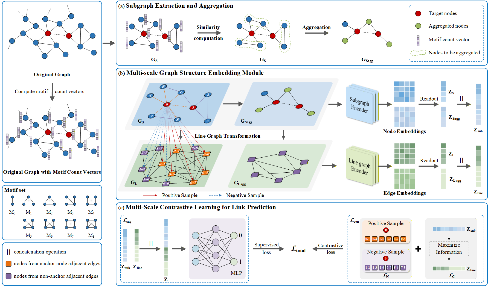

# CSLG

Yao Y, Zhou W, Chen Y, et al. [Cross-Scale Contrastive Learning with Subgraph and Line-Graph Views for Link Prediction](论文链接)[J]. Physica A: Statistical Mechanics and its Applications, 2026: 131663.

## Abstract

Link prediction aims to infer potential or missing connections from observed
network structures and represents a fundamental problem in complex network analysis. In recent years, graph neural networks have achieved significant progress in this field. However, most existing methods ignore edge-level
structural information and rely solely on single-scale subgraph representations, limiting their ability to capture complementary information across
structural scales. To address these limitations, we propose Cross-Scale Contrastive Learning with Subgraph and Line-Graph Views for link prediction.
Specifically, enclosing subgraphs centered on target node pairs are extracted
and aggregated to construct multi-scale subgraphs. Both the enclosing and
aggregated subgraphs are further transformed into line graphs, enabling joint
representation learning at the node and edge levels to capture complementary
structural information. Finally, a cross-scale contrastive learning strategy is
introduced to integrate multi-source representations and improve discriminative performance. Extensive experiments on nine publicly available datasets
demonstrate that CSLG consistently outperforms existing baseline methods
in terms of prediction accuracy and generalization performance.

## Method Overview



*Figure: Overall framework of CSLG for link prediction.*

## 🔗 Code

Coming soon.

## 📝 Citing

If you find CSLG useful in your research, please consider citing:

```bibtex
@article{Yao2026CSLG,
  title={Cross-Scale Contrastive Learning with Subgraph and Line-Graph Views for Link Prediction},
  author={Yao, Yabing and Zhou, Wei and Chen, Yingwei and others},
  journal={Physica A: Statistical Mechanics and its Applications},
  pages={131663},
  year={2026}
}
```
